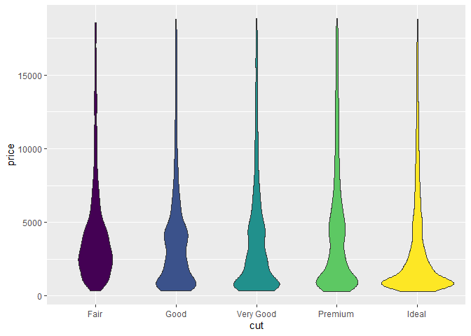

## Introduction

   Jekyll blogs allow their owners to have a massive amount of control
in how their websites are presented by sourcing individual posts from
Markdown files. While it seems good at first, this restriction to
Markdown files cuts off one of a data scientist’s greatest tools: R
Markdown.

   R Markdown has a pivotal place in the field of data
science. Data science is a discipline that heavily relies upon
reproducibility. The code used to analyze data should be accessible for
those seeking to reproduce the analysis so that they may verify your
results.

   While it is possible to simply copy and paste your code into your
reports and blogs, R Markdown provides a much cleaner and
simpler alternative by letting you perform your analysis directly in the
report file. When these documents are rendered, the code is evaluated
and included in the report, according to the parameters you set in the
document.

   This evaluation is not performed when the post page is rendered in
Jekyll; in fact, Jekyll does not even recognize any file type other than
.md as a blog post. This can be extremely frustrating to someone seeking
to make their code. Luckily, there is a way to get around this.

## How to

   The solution is deceptively simple. When you create an R Markdown in Posit (R-Studio), you are only offered three selections for
which file types your file can be rendered into. These three options are
HTML, PDF and Word. In reality, there are additional types, each with
their own uses. The one we will focus on today is gfm, or Github
Flavored Markdown. This is a special type of markdown that seamlessly
integrates itself into Github-based Jekyll blogs.

   To render your document into gfm, replace the top output option in
the YAML code at the top of your file with the following code.

    output:
      md_document:
        variant: gfm
        preserve_yaml: False

   After you render your converted markdown file, add the YAML needed at
the top of the file to publish the blog. Make sure the file is in the
correct folder—usually designated as `_posts`—and you are good to go!

## Images

   There is a small caveat to be aware of while using this method:
images. When you render your R Markdown file to one of the
three standard options, your images are embedded in the file. When you
render to a markdown file, however, the images are placed in a separate
folder and only referenced in the markdown. When you push your post to
your github repository, these images must be pushed as well. The
references in your markdown file must point to the correct file location
in order for the images to be correctly displayed.

   I suggest simplifying this by designating the folder in which your
images will be stored at the beginning of your R Markdown file with the
following code:

    knitr::opts_chunk$set(fig.path = "images/")

   You can push this folder with your blog post. If you follow these
steps, The only editing that will need to be made is to add 'Figure' into the brackets before the image link, as in the example below:

## sources

While researching and creating this blog post, I was only able to find
one other place where people were discussing how to link

<https://jchellmuth.com/news/jekyll/website/code/2020/01/04/Rmarkdown-posts-to-Jekyll.html>

## Additional Help

   If you need additional help getting this process to work, feel free
to dig through the documentation for this very blog post at the links
below:

   Here is a simple plot to demonstrate how to include images.

``` r
library(tidyverse)
library(ggplot2)
ggplot(data = mpg) +
  geom_violin(aes(y=cty, x=hwy, fill = as.factor(cyl)))
```

<!-- -->
